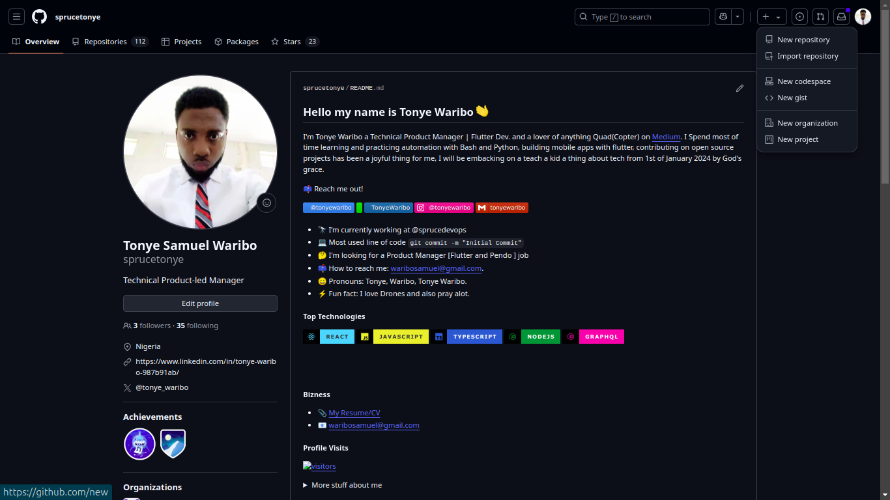
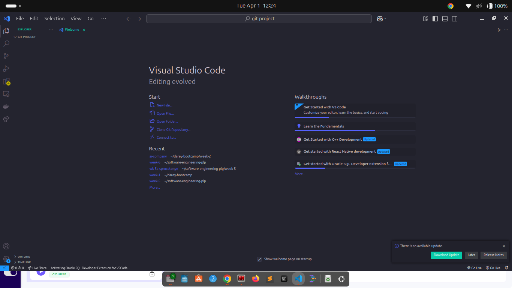
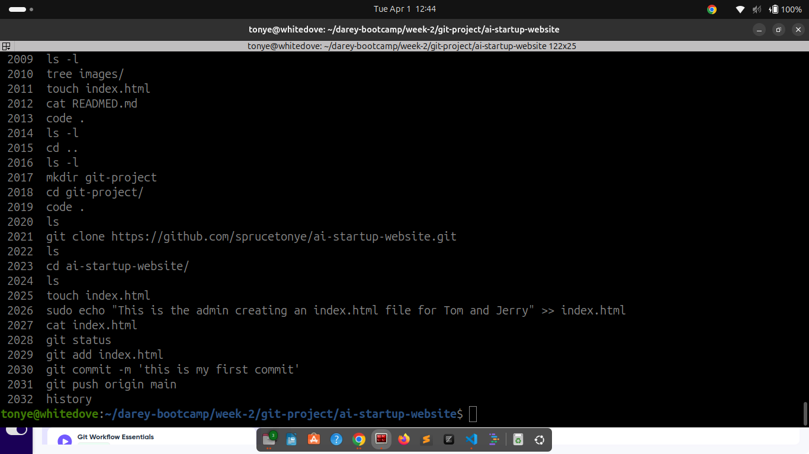
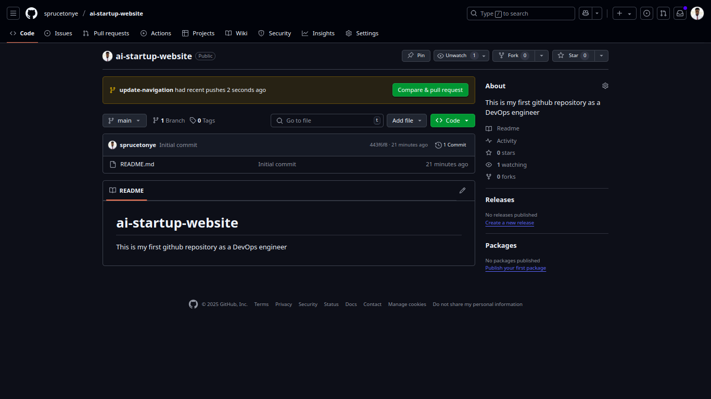

# ai-startup-website
This is my first github repository as a DevOps engineer

---

# My Terminal Commands
- `ls -l`
-  `2017  mkdir git-project`
-  `2018  cd git-project/`
-  ` 2019  code .`
-  ` 2020  ls`
-  ` 2021  git clone https://github.com/sprucetonye/ai-startup-website.git`
-  ` 2022  ls`
-  ` 2023  cd ai-startup-website/`
-  ` 2024  ls`
-  ` 2025  touch index.html`
-  ` 2026  sudo echo "This is the admin creating an index.html file for Tom and Jerry" >> index.html `
-  ` 2027  cat index.html `
-  ` 2028  git status `
-  ` 2029  git add index.html `
-  ` 2030  git commit -m 'this is my first commit'`
-  ` 2031  git push origin main `
-  ` 2032  history `